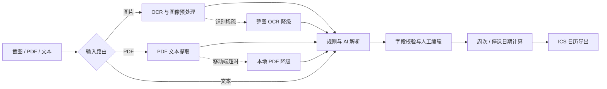

<div align="center">

# CampusFlow AI 校园时间管家

把课表截图、PDF 与校园通知转换为可检查、可编辑、可导出的日历事件。

*Turn campus screenshots, PDFs and notices into validated calendar events.*


[功能概览](#核心能力) · [处理链路](#处理链路) · [本地运行](#本地运行) · [工程质量](#工程质量)

</div>

## 项目背景

课程表、考试安排、作业截止时间和校园通知常常分散在截图、教务系统 PDF 与聊天文本中。手动录入日历不仅耗时，还容易遗漏周次、教室和停课日期。

CampusFlow 将这些非结构化信息送入一条可降级、可校验的处理链路：提取内容、解析事件、人工确认，再导出通用的 `.ics` 日历文件。它不是只依赖一次模型调用的聊天套壳，而是结合 OCR、PDF 解析、规则引擎、AI 解析与日历计算的完整 AI 应用工程。

## 核心能力

| 输入与场景 | 处理方式 |
| --- | --- |
| 课表截图 | 识别表格单元格、修复 OCR 噪声并重建课程行 |
| 教务系统 PDF | 提取课表文本，并在 PDF.js 不可用时切换解析方案 |
| 考试通知 / 准考证 | 解析日期、时间、考场、座位号等字段 |
| 作业与通知文本 | 从自然语言中识别截止时间和事件内容 |
| 学期课表 | 处理每周、单双周、指定周次与自定义节次 |
| 日历交付 | 编辑确认后生成 ICS，导入主流日历应用 |

项目还针对手机上传补充了 WebP、大尺寸图片、旧版 WebView、服务端超时与本地降级策略。

## 处理链路



解析结果不会直接写入日历。用户可以先检查课程、考试、作业和通知事件，再调整学期起始日、周次、地点等字段后导出。

## 工程亮点

### 多级解析，而非单点依赖

- 根据图片、PDF 和纯文本选择不同提取路径。
- 将本地规则解析与 DeepSeek 兼容接口分层组合。
- 对空结果、超时和低质量识别设置明确的失败与降级路径。

### 面向真实教务材料的 OCR 修复

- 将课表单元格 OCR 重建为可解析的课程行。
- 修复常见教室编号、空格和中文时间范围噪声。
- 稀疏表格结果回退到整图识别，并针对准考证表格裁剪行区域。

### PDF、移动端与日历计算

- 支持教务系统 PDF、iText 文档、serverless JS fallback 和移动端本地降级。
- 展开每周、单周、双周与指定周次课程，并根据学期起始日计算日期。
- 排除停课日期，生成兼容日历应用的 ICS 事件。

## 工程质量

核心测试覆盖解析路由、OCR 噪声修复、真实 PDF 提取、节次模板、周次引擎、移动端上传策略与 ICS 导出。

本地验证：**51 项测试通过，0 项失败；ESLint 通过。**

```bash
npm run test:core
npm run lint
npm run build
```

> `51 tests passing` 是当前 `tests/core/` 的实际结果，不代表未经测量的代码覆盖率或 OCR 准确率。

## 技术栈

| 领域 | 技术 |
| --- | --- |
| Web 全栈 | Next.js 16、React 19、TypeScript |
| 状态与样式 | Zustand、Tailwind CSS 4 |
| OCR / 图像 | Tesseract.js、Sharp、Python 图像预处理 |
| PDF | PDF.js、自定义直接提取器、JS fallback |
| AI 解析 | DeepSeek 兼容 API、结构化提示词与结果校验 |
| 数据与日历 | Prisma、PostgreSQL、ICS / RRULE |
| 测试与交付 | Node.js Test Runner、ESLint、GitHub Actions、Vercel / GitHub Pages |

## 项目结构

```text
src/
├── app/                  # 上传、编辑、导出页面与 API
├── lib/
│   ├── ai/               # 模型客户端与结构化提示词
│   ├── ocr/              # OCR 与图像预处理
│   ├── pdf/              # PDF 多级提取方案
│   ├── parser/           # 解析路由、模板匹配和校验
│   ├── events/           # 周次与日期展开
│   └── ics/              # ICS 与 RRULE 生成
└── stores/               # 课程、事件与流程状态

tests/core/               # 51 项核心行为测试
prisma/                   # PostgreSQL 数据模型
```

## 本地运行

环境要求：Node.js 20+，推荐使用项目工作流一致的 Node.js 22。

```bash
git clone https://github.com/liutianyi746-lab/campusflow-web.git
cd campusflow-web
npm install
npm run dev
```

访问 [http://localhost:3000](http://localhost:3000)。

## 环境配置

按需在本地 `.env.local` 中配置，切勿提交真实密钥。

| 变量 | 用途 |
| --- | --- |
| `DEEPSEEK_API_KEY` | 启用 DeepSeek 兼容的 AI 解析 |
| `DATABASE_URL` | Prisma 使用的 PostgreSQL 连接地址 |
| `NEXT_PUBLIC_API_BASE_URL` | 静态前端连接独立 API 服务的地址 |
| `NEXT_PUBLIC_BASE_PATH` | GitHub Pages 等子路径部署的基础路径 |
| `CORS_ALLOW_ORIGIN` | 独立前后端部署时允许的前端来源 |
| `CAMPUSFLOW_PORTABLE_OCR_ONLY` | 强制使用可移植 OCR 路径 |

没有 AI Key 时，规则解析、PDF 文本提取、周次计算和 ICS 生成等本地能力仍可独立工作；复杂自然语言的识别效果会受限。

## 已知限制

- OCR 结果受截图清晰度、字体、表格线和压缩质量影响。
- 不同学校的课表布局差异较大，未知模板可能需要人工校正。
- AI 解析依赖外部模型服务，结果应经过人工检查后再导入日历。

## 路线图

- 扩充更多学校课表与准考证模板夹具。
- 增强隐私友好的本地识别能力。
- 为上传、编辑、导出主流程补充端到端测试。
- 提供更直观的识别置信度和字段来源说明。

---

建议从 [`tests/core/event-flow.test.ts`](tests/core/event-flow.test.ts)、[`src/lib/parser/parser-router.ts`](src/lib/parser/parser-router.ts) 和 [`src/lib/ics/ics-builder.ts`](src/lib/ics/ics-builder.ts) 开始阅读。
