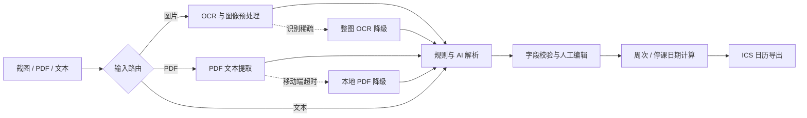

# CampusFlow GitHub Showcase Implementation Plan

> **For agentic workers:** REQUIRED SUB-SKILL: Use superpowers:subagent-driven-development (recommended) or superpowers:executing-plans to implement this plan task-by-task. Steps use checkbox (`- [ ]`) syntax for tracking.

**Goal:** Replace the default Next.js README with a truthful, recruitment-focused CampusFlow showcase for AI application and full-stack roles.

**Architecture:** Keep the change documentation-only: one structured `README.md` is the public entry point, GitHub-native Mermaid explains the processing pipeline, and existing package scripts provide verification evidence. Do not alter application code, dependencies, deployment configuration, or secrets.

**Tech Stack:** GitHub Flavored Markdown, Mermaid, Next.js 16, React 19, TypeScript, Node.js test runner, ESLint

## Global Constraints

- Chinese is the primary language; include one concise English summary near the top.
- Only publish claims supported by repository code, tests, or deployment configuration.
- Do not invent user counts, OCR accuracy, performance metrics, or delivery dates.
- Do not expose `.env`, `.env.local`, API keys, Vercel identifiers, or other secrets.
- Do not add a license badge unless a repository-level license exists.
- Do not add runtime dependencies or modify business logic.
- Do not automatically push to the remote repository.

---

## File Map

- Modify: `README.md` — GitHub landing page, product narrative, architecture, engineering evidence, setup, limitations, and roadmap.
- Reference: `package.json` — source of exact commands and dependency versions.
- Reference: `src/lib/` and `src/app/api/` — evidence for OCR, PDF, parsing, calendar, AI, and API claims.
- Reference: `tests/core/` — evidence for the 51-test statement and tested domains.
- Reference: `.github/workflows/pages.yml` — evidence that GitHub Pages static deployment is configured.
- Existing design: `docs/superpowers/specs/2026-07-15-github-showcase-design.md` — approved scope and presentation rules.

### Task 1: Replace the default README with the recruitment-focused showcase

**Files:**
- Modify: `README.md`
- Reference: `package.json`
- Reference: `src/lib/parser/parser-router.ts`
- Reference: `src/lib/ics/ics-builder.ts`
- Reference: `src/lib/events/week-engine.ts`
- Reference: `src/app/api/upload/route.ts`

**Interfaces:**
- Consumes: Existing source modules and package scripts as factual evidence.
- Produces: A GitHub-renderable `README.md` with stable anchors and no external runtime requirements.

- [ ] **Step 1: Record the current README failure condition**

Run:

```powershell
Select-String -Path README.md -Pattern 'This is a \[Next.js\]|create-next-app|Learn More|Deploy on Vercel'
```

Expected: one or more matches proving the landing page is still the framework template.

- [ ] **Step 2: Replace `README.md` with the complete showcase structure**

The document must contain these exact top-level sections in this order:

```markdown
<div align="center">

# CampusFlow AI 校园时间管家

把散落在课表截图、PDF 与通知文本中的时间信息，转换为可检查、可编辑、可导出的日历事件。

*Turn campus screenshots, PDFs and notices into validated calendar events.*

[功能概览](#核心能力) · [处理链路](#处理链路) · [本地运行](#本地运行) · [工程质量](#工程质量)

</div>

## 项目背景
## 核心能力
## 处理链路
## 工程亮点
## 工程质量
## 技术栈
## 项目结构
## 本地运行
## 环境配置
## 已知限制
## 路线图
```

Under the hero, add a single badge row for Next.js 16, TypeScript, React 19, and `51 tests passing`. Do not add CI, coverage, license, or deployment badges whose live status has not been verified.

Use this Mermaid data flow, preserving the fallback path:



The content must explicitly but concisely cover:

- inputs: timetable screenshots, education-system PDFs, exam notices, homework/deadline text;
- outputs: course, exam, homework, and notice events plus ICS export;
- parsing: OCR repair, table row reconstruction, PDF fallback, rule/AI routing;
- scheduling: every/odd/even/specific weeks, editable semester start, no-class dates;
- mobile: WebP, large uploads, older WebViews, server upload and local fallback;
- truthful limitation: recognition quality depends on source clarity and school formatting;
- roadmap without dates: more school templates, privacy-preserving local recognition, end-to-end fixtures.

Use this exact commands block in `本地运行`:

```bash
git clone https://github.com/liutianyi746-lab/campusflow-web.git
cd campusflow-web
npm install
npm run dev
```

Use this exact verification block in `工程质量`:

```bash
npm run test:core
npm run lint
npm run build
```

In `环境配置`, mention only variable names confirmed by source using `process.env`; do not copy values from local environment files.

- [ ] **Step 3: Verify the old framework template is gone**

Run:

```powershell
$matches = Select-String -Path README.md -Pattern 'This is a \[Next.js\]|create-next-app|Learn More|Deploy on Vercel'
if ($matches) { $matches; exit 1 }
```

Expected: exit code 0 with no output.

- [ ] **Step 4: Verify required sections and Mermaid fences exist**

Run:

```powershell
$required = @('## 项目背景','## 核心能力','## 处理链路','## 工程亮点','## 工程质量','## 技术栈','## 项目结构','## 本地运行','## 环境配置','## 已知限制','## 路线图')
$text = Get-Content README.md -Raw
$missing = $required | Where-Object { -not $text.Contains($_) }
if ($missing) { $missing; exit 1 }
if (($text | Select-String -Pattern '```mermaid' -AllMatches).Matches.Count -ne 1) { exit 1 }
```

Expected: exit code 0 with no output.

- [ ] **Step 5: Check the Markdown diff for formatting errors and secrets**

Run:

```powershell
git diff --check
Select-String -Path README.md -Pattern 'sk-[A-Za-z0-9]|API_KEY\s*=|SECRET\s*=|TOKEN\s*='
```

Expected: `git diff --check` exits 0 and secret scan returns no matches.

- [ ] **Step 6: Commit the public README**

```bash
git add README.md
git commit -m "docs: showcase CampusFlow on GitHub"
```

Expected: one commit containing only `README.md`.

### Task 2: Verify every public claim against the repository

**Files:**
- Modify if corrections are needed: `README.md`
- Test: `tests/core/*.test.ts`
- Reference: `.github/workflows/pages.yml`

**Interfaces:**
- Consumes: The README produced by Task 1 and the existing application/test suite.
- Produces: A verified README whose metrics and commands match current behavior.

- [ ] **Step 1: Run the core tests**

Run:

```powershell
npm.cmd run test:core
```

Expected: `tests 51`, `pass 51`, `fail 0`.

- [ ] **Step 2: Run ESLint**

Run:

```powershell
npm.cmd run lint
```

Expected: exit code 0 and no ESLint errors.

- [ ] **Step 3: Run the production build**

Run:

```powershell
npm.cmd run build
```

Expected: exit code 0 and a successful Next.js production build.

- [ ] **Step 4: Audit environment-variable names against source**

Run:

```powershell
Get-ChildItem src,scripts -Recurse -File | Select-String -Pattern 'process\.env\.[A-Z0-9_]+' | ForEach-Object { $_.Matches.Value } | Sort-Object -Unique
```

Expected: every variable named in README appears in this output; remove any unsupported README variable.

- [ ] **Step 5: Audit the final diff and commit any evidence corrections**

Run:

```powershell
git diff --check
git status --short
git diff -- README.md
```

Expected: no whitespace errors; if README changed after evidence checks, the diff contains only factual corrections.

If corrections were required:

```bash
git add README.md
git commit -m "docs: align showcase claims with verification"
```

If no corrections were required, do not create an empty commit.

### Task 3: Prepare the GitHub handoff without changing remote state

**Files:**
- Inspect: `README.md`
- Inspect: `docs/superpowers/specs/2026-07-15-github-showcase-design.md`
- Inspect: `docs/superpowers/plans/2026-07-15-github-showcase.md`

**Interfaces:**
- Consumes: Verified local commits from Tasks 1 and 2.
- Produces: A clean local branch and exact handoff information for review/push.

- [ ] **Step 1: Confirm the worktree is clean**

Run:

```powershell
git status --short
```

Expected: no output.

- [ ] **Step 2: Summarize local commits relative to the original project head**

Run:

```powershell
git log --oneline 7e1766b..HEAD
```

Expected: the design commit, plan commit, README showcase commit, and any factual-correction commit.

- [ ] **Step 3: Verify the remote target without pushing**

Run:

```powershell
git remote -v
```

Expected: `origin` points to `https://github.com/liutianyi746-lab/campusflow-web.git` for fetch and push.

- [ ] **Step 4: Hand off for user review**

Report the local branch, commit list, verification results, and the full path to `README.md`. Do not run `git push` unless the user explicitly approves publishing the verified changes.
